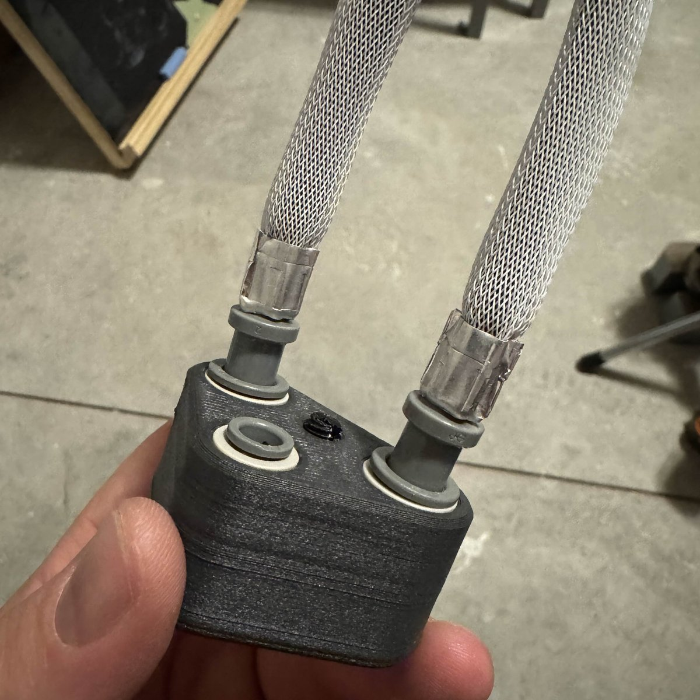
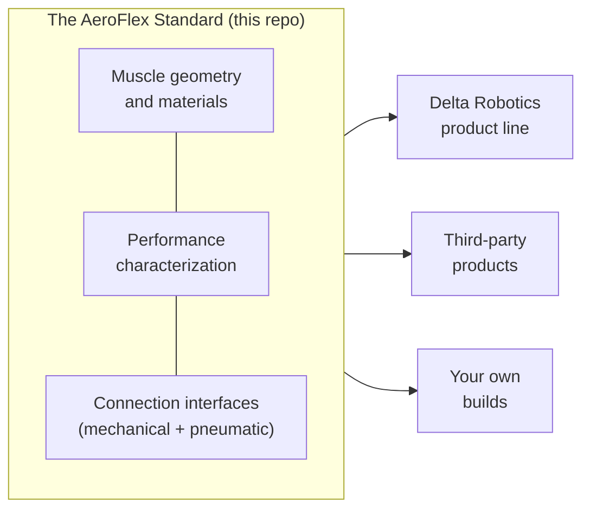
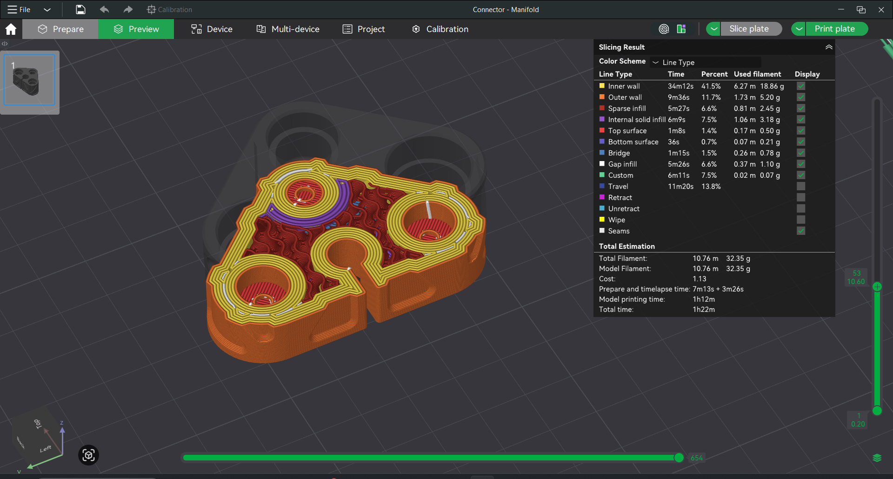

# AeroFlex

**AeroFlex is an open standard for braided pneumatic artificial muscles (PAMs): documented geometry, repeatable performance, and standard connection interfaces, so muscles and the parts that drive them work together no matter who built them.**

Pneumatic muscles have been in labs since the 1950s. They are light, strong,
compliant, silent, and cheap to make, yet they never went mainstream, because
every muscle is a one-off: undocumented geometry, unknown force curves, and
no standard way to connect one to anything. AeroFlex fixes the boring part.
It specifies the muscle and its interfaces the way a servo's spline, plug,
and PWM signal are specified, so an entire ecosystem can build against it.

Delta Robotics ships its own AeroFlex product line, and anyone else can build
muscles, controllers, kits, and machines for the same ecosystem. The standard
is Apache-2.0: free for anyone to implement, commercially or otherwise. Only
the AeroFlex name is reserved (see [Ecosystem](#ecosystem-and-compatibility)).

## Build your first muscle

The current build is hand-assembled from about $10 of off-the-shelf
parts in under an hour:

1. Order the parts in the [muscle BOM](manufacturing/muscle-bom.md):
   latex tubing, PET overexpanded braided sleeve, adhesive-lined heat shrink,
   barb connectors, push-to-connect cartridges, and crimp ferrules.
2. Follow the assembly sequence in
   [`manufacturing/muscle-assembly.md`](manufacturing/muscle-assembly.md):
   cut, sleeve, shrink, crimp, and pressure-test.
3. Drive it with regulated air or CO2 in the 30-100 psi range. A correct
   build contracts smoothly and holds pressure; current builds target the
   20-35% stroke range, with about 50% as the design goal.

Before pressurizing anything, read the validation and safety notes in
[`docs/design.md`](docs/design.md). Compressed gas stores real energy.

## What is in this repo

| Path | Contents |
|---|---|
| [`docs/design.md`](docs/design.md) | The reference muscle design: materials, geometry, manufacturability, validation plan |
| [`docs/theory.md`](docs/theory.md) | Force-pressure equation, stroke theory, design references |
| [`docs/components.md`](docs/components.md) | BOM: fittings, threads, regulators, valves, CO2, sourcing links |
| [`docs/background.md`](docs/background.md) | Why artificial muscles have not gone mainstream, and what changes that |
| [`docs/test-rig-electronics.md`](docs/test-rig-electronics.md) | As-built electronics map and commissioning prerequisites for the tensile-test rig |
| [`manufacturing/`](manufacturing/) | Muscle BOM, assembly process, and airtight manifold printing |
| [`apps/hud/`](apps/hud/) | Zero-install browser telemetry HUD for muscle controllers (Web Serial), with a documented protocol any Arduino can speak |
| [`firmware/`](firmware/) | Safe PlatformIO commissioning baseline for the Arduino Uno R4 Minima test rig |
| [`research/`](research/) | Cited research library: PAM modeling, sensing, fabrication methods, vendor surveys |
| [`datasheets/`](datasheets/) | Vendor spec-sheet index with source links |

*Inside a printed connector block - the airtight-printing guide covers how
walls, infill, and finishing make FDM parts hold pressure
([manufacturing/airtight-3d-printing.md](manufacturing/airtight-3d-printing.md)).*

## Status and roadmap

The standard is pre-1.0 and under active development. Documented today:
muscle construction, materials, theory, and the working fitting and thread
choices.

*The hardware iterates alongside the docs - regulator mount, inline
regulator, and connector block prototypes.*

On the way to a 1.0 release:

- Formal interface specification (mounting, pneumatic connections, sensing)
- Published force-pressure-stroke curves for reference builds
- Conformance checklist for "AeroFlex compatible" claims

Watch [CHANGELOG.md](CHANGELOG.md) and the
[proposals](https://github.com/Delta-Robotics-Inc/AeroFlex/issues) for
changes. Nothing is stable until 1.0.

## Ecosystem and compatibility

You do not need permission to implement this standard, sell products built
on it, or say your product "works with the AeroFlex Standard". The name
"AeroFlex" itself is a Delta Robotics trademark; the short rules for using
it are in [TRADEMARKS.md](TRADEMARKS.md).

## Contributing

Doc fixes and build reports can go straight to a PR; changes to the standard
start as a proposal issue. See [CONTRIBUTING](.github/CONTRIBUTING.md) for
the process (including DCO sign-off) and
[SECURITY.md](.github/SECURITY.md) for reporting safety-relevant errors
privately.

## License

Apache-2.0 (`SPDX-License-Identifier: Apache-2.0`). See [LICENSE](LICENSE)
and [NOTICE](NOTICE). The license grants patent rights but not trademark
rights; trademark use is covered by [TRADEMARKS.md](TRADEMARKS.md).
