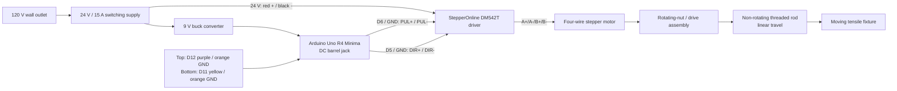

# AeroFlex tensile-test rig: electronics as built

## Purpose and scope

This document records the test rig from the authoritative photo set and the
confirmed wire trace supplied during commissioning. It is not authority to
alter mains wiring or run a loaded test.

**Controller baseline:** the active rig controller is the **Arduino Uno R4
Minima**. The photos that show an Elegoo Uno R3 are retained as useful wiring
references for the earlier controller only; they must not change the active
firmware target or pin interpretation.

## Confirmed architecture



## Power path

- The mains input selector is set to `110 V` (appropriate for the stated
  120 V outlet). It must never be changed while energized.
- The switching supply is 24 V, 15 A. Its heavy red output feeds the driver
  `+V`; its heavy black output feeds driver `GND`.
- A buck converter receives the same 24 V supply and provides 9 V through the
  Arduino DC barrel jack. The Arduino does not power the motor.
- The DM542T accepts 20-50 V DC, so the 24 V motor supply is compatible.

### Arduino buck converter / voltage display

The visible voltage-display module is the DC-DC buck converter in the Arduino
power path, not merely a voltmeter. Its observed terminal map is:

| Buck terminal | Wire | Role |
|---|---|---|
| `+IN` | Red | 24 V supply positive input |
| `-IN` | Black | 24 V supply negative input |
| `+OUT` | Yellow | Regulated positive output, intended as 9 V to Arduino barrel jack |
| `-OUT` | Green | Regulated output return to Arduino barrel jack |

Do not assume its displayed output is correct solely from the setting; confirm
the display reads approximately 9 V before relying on the Arduino barrel-jack
power path.

### Power-supply terminal map
][\]
The supply has a nine-position terminal strip. The following map uses the
user's position numbers, counted from the DC-output end toward the AC-input
end. Its functional roles are inferred from the printed terminal grouping and
must be confirmed from the labels (`+V`, `-V`, earth, `N`, `L`), **not from wire
color**.

| Terminal position | Observed termination | Inferred role |
|---|---|---|
| 1 | Empty | `+V` spare output |
| 2 | Red wire, red insulated head | `+V` output |
| 3 | Red wire, red insulated head | `+V` output |
| 4 | Empty | `-V` spare output |
| 5 | Black wire, red insulated head | `-V` output |
| 6 | Black wire, black insulated head | `-V` output |
| 7 | White wire, turquoise insulated head | Protective earth / chassis ground (inferred) |
| 8 | Gray wire, turquoise insulated head | AC neutral `N` (inferred) |
| 9 | Black wire, turquoise insulated head | AC line/hot `L` (inferred) |

The conductors at 7-9 form the mains-input cable and must be treated as live
when the power cord is connected. Do not loosen, move, probe, or rely on the
colors of these terminals. A clear, de-energized close photo of the embossed
terminal labels is the remaining evidence needed to promote the inferred
earth/neutral/line assignments to confirmed status.

## Stepper driver and motor wiring

The motor driver is a **StepperOnline DM542T digital stepping driver**.

The rig uses the smaller motor in the supplied `stepperonline-nema23-protoparts`
archive: **StepperOnline 23HS32-4004S**. It is a four-wire bipolar NEMA 23
stepper with an 82 mm body, 8 mm D-cut shaft, 1.8 degree step angle (200 full
steps/revolution), 2.4 N m holding torque, and a **4.0 A/phase maximum rating**.

| DM542T terminal | Confirmed connection | Function |
|---|---|---|
| `GND` | Heavy black wire from 24 V supply | DC supply negative |
| `+V` | Heavy red wire from 24 V supply | DC supply positive |
| `A+` | Black motor wire | Motor winding A positive |
| `A-` | Green motor wire | Motor winding A negative |
| `B+` | Red motor wire | Motor winding B positive |
| `B-` | Blue motor wire | Motor winding B negative |
| `PUL+` | Uno R4 D6, purple wire | Step pulse input |
| `PUL-` | Uno R4 GND, white/gray wire | Step pulse return |
| `DIR+` | Uno R4 D5, dark-blue wire | Direction input |
| `DIR-` | Uno R4 GND, white/gray wire | Direction return |
| `ENA+`, `ENA-` | Not connected | Optional driver-enable input |

Because `ENA` is not wired, stopping pulses halts commanded motion but may not
remove motor holding torque. The 24 V motor-power disconnect is the practical
stop method during this commissioning phase.

## Drive rotary encoder and threaded-rod mechanism

The photographed encoder is an **LPD3806-400BM-G5-24C** incremental optical
rotary encoder. It is coupled to the drive assembly, so it can provide measured
drive rotation/position feedback after its mechanical coupling ratio and
Arduino-side wiring are verified.

**Authoritative mechanical operating model (photo IMG_3239):** the threaded
rod enters a central threaded hub in the large circular drive assembly. Treat
the rod as a **non-rotating, linearly translating member** driven by that
rotating nut/gear assembly. Do not manually rotate, push, pull, or loosen the
rod while the mechanism is bound. The exact gear ratio remains to be measured.

Identity provenance: the model number was read from the installed unit's
photographed `TYPE: LPD3806-400BM-G5-24C` nameplate. It is independently
corroborated by `protoparts-loadcell-encoder.zip`, whose
`lpd3806-400bm-g5-24c/definition.json` and `OVERVIEW.md` explicitly identify
the same model and state that the definition was anchored to the user's
physical unit.

| Property | Value |
|---|---|
| Encoder type | Incremental optical, quadrature A/B |
| Resolution | 400 pulses/revolution per channel |
| Quadrature count resolution | 1,600 counts/revolution with x4 decoding (0.225 degree/count) |
| Supply / consumption | 5-24 V DC / 40 mA maximum |
| Output type | NPN open-collector, sink-only |
| Response rate | Vendor range 20-30 kHz; design to 20 kHz |
| Published max mechanical speed | 5,000 rpm; use the lower 2,000 rpm integrated-speed figure for design margin |
| Body / cable | 38 mm diameter x 51 mm metal body; 1.5 m cable |
| Shaft | 6 mm x 13 mm; do not assume D-flat geometry without checking the unit |
| Labelled connections | `Vcc`, `0V`, `A`, `B`, `G` (cable shield) |

The physical label shows only `A` and `B`; treat this installed unit as an
**A/B-only encoder**. Do not assume a Z/index output even though some online
LPD3806 variants advertise one.

The generic source package maps the family cable as red = `Vcc`, black = `0V`,
green = `A`, white = `B`, plus a bare/foil shield = `G`. The installed AeroFlex
rig has been physically traced differently: its **insulated gray conductor is
authoritatively connected to Arduino D3**, while white is connected to D2.
This installed color observation takes precedence over the generic family
color convention for this rig. The D3 signal's expected role as channel A will
be verified electrically by the encoder diagnostic.

`A` and `B` are open-collector outputs, not voltage-driving outputs. They
require a **separate pull-up resistor on each
channel** (typically 1-10 kOhm) to the Arduino's 5 V logic rail; never hard-tie
`A` or `B` to `Vcc`. Encoder `0V` must share Arduino ground. The shield is not
a signal or a supply return: bond it to chassis/system ground at one end only.

If the encoder is powered above 5 V, the two output pull-ups must still be to
the Arduino's 5 V logic rail, not to the higher encoder supply. Read A/B using
edge interrupts or a hardware quadrature counter; polling can lose counts.

The reported Arduino-side trace is:

| Encoder-side wire | Expected label/function | Arduino connection | Status |
|---|---|---|---|
| Red | `Vcc` | `5V` | Confirmed |
| Black | `0V` | `GND` | Confirmed |
| White | `B` | D2 | Confirmed |
| Gray insulated wire | Expected `A` signal | D3 | Installed color and D3 destination confirmed; channel behavior to test |

D2 and D3 are suitable for interrupt-driven quadrature decoding. The original
family convention calls the `A` conductor green, but the installed conductor
on D3 is confirmed gray and insulated. It is not to be relabeled green. The
firmware treats gray D3 as the candidate A input and tests its raw level, edge
count, quadrature relationship, direction, counts/revolution, and comparison
against emitted motor pulses. Arduino internal pull-ups are used only for the
initial slow diagnostic; fit external pull-ups before relying on high-speed
encoder measurements.

Encoder counts are relative and are lost at reset/power-off; a verified travel
limit/home operation is still required to establish an absolute zero. If the
encoder is 1:1 with the rotating drive assembly, its linear resolution will be:

```text
encoder_counts_per_mm = 1600 / drive_travel_mm_per_revolution
```

### Initial powered-motion encoder observation

The first command labelled as a guarded fast upward seek actually drove the
carriage physically **downward toward the bottom switch**. The operator stopped
the run early. This establishes that the original direction definition was
reversed: D5 HIGH is physical down and D5 LOW is physical up. Firmware now
defines physical up as D5 LOW so that the D12/D11 directional-limit checks
match real travel.

| Observation | Value |
|---|---:|
| Emitted DM542T command pulses | 31,152 |
| Encoder quadrature-count change | +46,274 |
| Absolute encoder/command ratio | 1.4854 |
| Invalid quadrature transitions | 0 |
| Nominal encoder-distance calculation | 109.901 mm |
| Command-pulse distance calculation | 73.986 mm |

This confirms that the gray-D3/white-D2 pair produces a clean directional
quadrature count during **downward** motion: downward was positive in this run,
so physical upward travel is expected to count negative. No invalid two-bit
transitions were observed. It does **not** yet establish an authoritative
distance scale. The 1.4854 ratio differs substantially from the
1.0000 expected only if all of the following assumptions are true: 1,600
driver pulses per motor revolution, 1,600 decoded encoder counts per encoder
revolution, and 1:1 motor/lead-screw/encoder coupling. Verify each assumption
with marked-shaft one-revolution tests and recheck the DM542T DIP positions
before changing firmware scale constants.

The operator deliberately stopped the run before a limit was confirmed.
Consequently, `Top reference: NOT SET` and the final top-confirmation error are
expected and do not constitute evidence of a D12 fault.

## DM542T DIP positions

The recorded switch positions are:

| Switch | Position |
|---|---|
| SW1 | off |
| SW2 | off |
| SW3 | off |
| SW4 | off |
| SW5 | on |
| SW6 | off |
| SW7 | on |
| SW8 | on |

On this driver, switches 1-3 set motor current and switches 5-8 set
pulses-per-revolution (microstepping). Do not change these until the motor
current rating and lead-screw travel calibration are documented.

The selected `SW5=on`, `SW6=off`, `SW7=on`, `SW8=on` setting is **1,600
pulses/revolution** (eight microsteps per 1.8 degree full step). Therefore a
future motion program must use `1600` as its starting pulses-per-revolution
constant, then calculate linear motion from the effective drive travel:

```text
pulses_per_mm = 1600 / drive_travel_mm_per_revolution
```

`SW1=off`, `SW2=off`, and `SW3=off` select the DM542T's 4.20 A peak / 3.0 A
RMS row. This does not exceed the identified motor's 4.0 A/phase rating, but
full holding current can still make a stationary stepper too hot to touch.
`SW4` is now **off**, enabling the DM542T's half-current-at-standstill mode.
Do not change DIP switches while energized and do not raise the current above
the current setting without a thermal test.

## Force measurement

The installed strain gauge/load cell is reported to be the [Adafruit Product
4543 20 kg, four-wire strain-gauge load cell](https://www.adafruit.com/product/4543).

The load cell is an aluminum beam with a bonded strain gauge, rated to 20 kg
(about 196 N) and measuring 75 x 12.7 x 12.7 mm. It has four M4 mounting holes
on a 10 / 44 / 10 mm center chain. One end must be fixed rigidly and the other
loaded only along the arrow-marked axis. Its raw bridge output requires a
precision load-cell ADC / Wheatstone-bridge interface; it cannot generate I2C
(`SCL`/`SDA`) signals by itself.

The cell is a passive full Wheatstone bridge with approximately 1,000 ohm bridge
impedance and 1.0 +/-0.1 mV/V rated sensitivity. At 5 V excitation, 20 kg full
scale is only about 5 mV differential, which explains why the HX711-class ADC
is mandatory. Published accuracy figures are 0.03% FS nonlinearity,
hysteresis, and repeatability; 0.05% FS creep over three minutes. Overload,
ingress rating, and an operating-temperature range are not published for this
specific part, so do not infer them.

The load cell terminates at a Wheatstone-bridge/load-cell ADC board with the
standard **HX711-style** terminal layout. It uses the board's higher-gain
Channel A; Channel B is intentionally unused.

| Load-cell wire | ADC terminal | Bridge function |
|---|---|---|
| Red | `+E` | Positive bridge excitation |
| Black | `-E` | Negative bridge excitation |
| White | `-A` | Observed Channel-A signal connection |
| Green | `+A` | Observed Channel-A signal connection |
| — | `+B`, `-B` | Unused Channel B |

The red/black excitation pair is strongly supported. Green/white are confirmed
as the signal pair, but color-to-polarity conventions vary across bar-cell
batches and sources. The observed `green -> +A`, `white -> -A` connection is
the rig's present configuration; validate the sign during calibration and
invert it in software (or swap only the signal pair with all power off) if an
increasing tensile load produces a decreasing reading.

The ADC board's Arduino-side connections are:

| ADC terminal | Wire | Arduino connection | Function |
|---|---|---|---|
| `GND` | Black | `GND` | Common ground |
| `DT` | Blue | `SDA` / A4 / D18 | HX711 data output |
| `SCK` | Green | `SCL` / A5 / D19 | HX711 clock input |
| Board power terminal, reported as `NCG` | Red | `5V` | Board power; verify the printed terminal label |

This interface is **not I2C**: the Arduino `SDA`/`SCL` labels describe the
physical pins used, while the HX711 uses its own `DT`/`SCK` synchronous serial
protocol. A future load-cell library must therefore use `DT = SDA` and
`SCK = SCL` as ordinary digital pins; it must not use an I2C scan or `Wire`.

The blue `DT` wire was accidentally cut. No reliable load-cell data can be
read until it is repaired and its connection from the ADC `DT` terminal to the
Arduino `SDA` pin is verified. Once repaired, the next safe firmware step is a
non-motion raw-reading/calibration program for Channel A. First verify the
board's reported `NCG` power-terminal label directly; it is expected to be the
HX711-style supply input but its printed marking has not been independently
read.

Before selecting it for a production test, compare its safe range to the
expected maximum tensile force and include an appropriate mechanical safety
margin. The manufacturer recommends selecting at least twice the intended
maximum load for useful measurement range.

## Commissioning code

### Consolidated Arduino Uno R4 Minima pin map

| Arduino connection | Observed wire(s) | Assigned circuit | Status / note |
|---|---|---|---|
| D6 | Purple | DM542T `PUL+` | Confirmed motor step signal |
| D5 | Blue | DM542T `DIR+` | Confirmed motor direction signal |
| GND near `S1` | Two combined gray/white wires | DM542T `PUL-` and `DIR-` returns | Confirmed shared driver return |
| D3 | Dark gray insulated wire | Encoder `A` (expected) | Verify it is not the bare shield |
| D2 | White | Encoder `B` | Confirmed from encoder color map |
| 5V | Red | Encoder `Vcc` | Confirmed encoder supply |
| Central GND | Two orange wires | Top and bottom limit-switch returns | Confirmed common return |
| Central GND | Black wire | Encoder `0V` | Confirmed encoder return |
| D11 | Yellow | Bottom limit switch | Reassigned from D13 to avoid the onboard `L` LED; press/release required after boot |
| D12 | Purple | Top limit switch | Press/release test passed |
| A4 / D18 / `SDA` | Blue, bottom four-wire group | HX711 `DT` | Wire is cut; repair required |
| A5 / D19 / `SCL` | Green, bottom four-wire group | HX711 `SCK` | Confirmed |
| 5V, lower header | Red, bottom four-wire group | HX711 board power | Board terminal label still to verify |
| GND, lower header | Black, bottom four-wire group | HX711 board ground | Confirmed |

Multiple Arduino `GND` and `5V` header positions are electrically common, but
their physical locations are recorded here to make the rig easier to trace. The
two red 5V connections belong to different circuits: encoder power and HX711
board power.

[`../firmware/src/main.cpp`](../firmware/src/main.cpp) is a supervised,
serial-commanded motion-commissioning utility. It does not move on boot. D6
issues step pulses and D5 sets direction only after an explicit command. It
uses `INPUT_PULLUP` on the confirmed switch inputs:

| Limit | Uno pin / wire | Ground | Pressed state |
|---|---|---|---|
| Top | D12 / purple | Orange | `LOW` |
| Bottom | D11 / yellow | Orange | `LOW` |

At 115200 baud, the serial monitor prints the initial states and then a
message for every debounced press and release. The prior bounded test showed
that `DIR=HIGH` moved the carriage upward. Both limit switches have passed the
firmware press/release test: D12 stops upward pulses and D11 stops downward
pulses. This remains an unloaded, continuously supervised commissioning setup.

### Hard coordinate and travel rule

The physical bottom switch is the sole zero reference for every test. Future
programs must not initiate upward test travel until bottom homing has succeeded.
Long end-to-end moves use a 350 mm accelerated fast segment followed by no more
than 50 mm of slow limit seeking. The reported mechanical travel is
approximately 360 mm.

Firmware tracks position from the bottom using emitted step pulses, the
DM542T's 1600-pulse/revolution setting, and the present 3.80 mm/revolution
effective-drive-travel estimate. This value is a **step-count estimate**, not independently measured
actual displacement. It must remain labeled that way until verified encoder
feedback is integrated. D12 must be checked before every upward pulse and D11
before every downward pulse in all future motion programs.

## Remaining work before automatic or loaded testing

1. Press/release-test both mapped switches with the diagnostic firmware.
2. Measure actual carriage travel for a known pulse count; then calibrate the
   effective drive travel to millimeters. Do not infer it from threaded-rod
   rotation.
3. Repair the HX711 `DT` wire, verify its supply-terminal marking, then take
   raw/tare/calibration readings with known reference loads.
4. Trace encoder A/B/0V/Vcc/shield to the Arduino; add 5 V logic pull-ups and
   validate quadrature counts during a supervised low-speed drive move after
   the mechanical bind is resolved.
5. Identify the voltage-display measurement points.
6. Set the DM542T current from the motor's documented rated current before
   re-enabling motor power; the recorded SW1-SW3 setting is maximum current.
7. Add hardware-verified limit handling and an accessible emergency-stop
   strategy before a specimen is installed.

## Evidence photo set

Physical-layout references: `IMG_3044.jpg`, `IMG_3039.jpg`, `IMG_3037.jpg`,
`IMG_3036.jpg`, `IMG_3035.jpg`, and `IMG_3029.jpg`.

Electronics references: `IMG_3167.jpg`, `IMG_3165.jpg`, `IMG_3162.jpg`,
`IMG_3160.jpg`, `IMG_3156.jpg`, `IMG_3153.jpg`, `IMG_3148.jpg`,
`IMG_3143.jpg`, `IMG_3142.jpg`, `IMG_3138.jpg`, `IMG_3135.jpg`, and
`IMG_3130.jpg`.

Component-source references: `protoparts-loadcell-encoder.zip` (load-cell and
encoder definitions, pinouts, and source captures) and
`stepperonline-nema23-protoparts.zip` (motor definition and datasheet captures).
