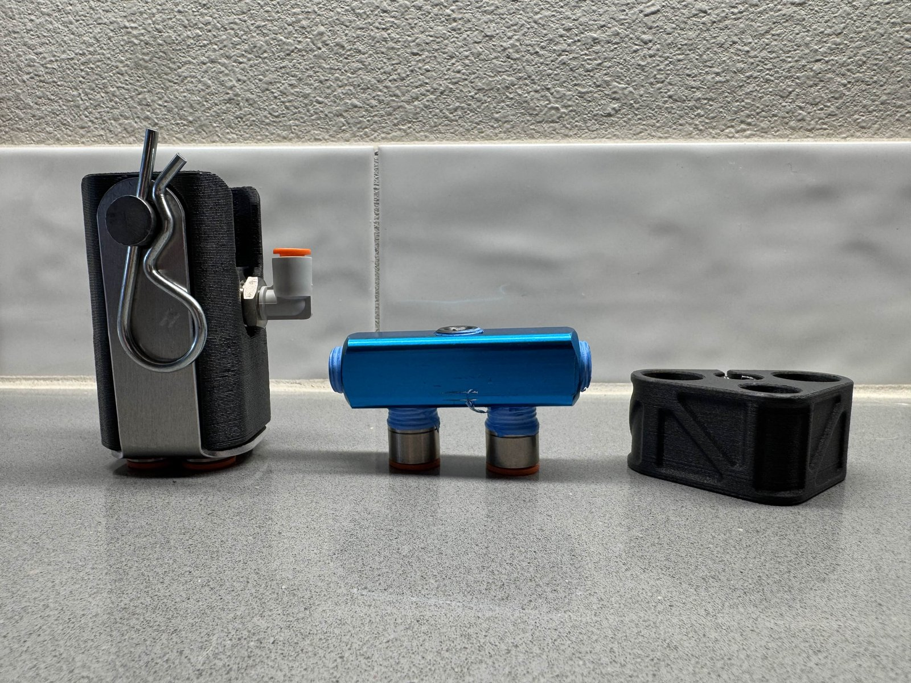

# Manufacturing

How AeroFlex muscles are built today. The process, like the rest of the
standard, is updated over time as we learn - changes land in the
[CHANGELOG](../CHANGELOG.md).

| Doc | Contents |
|---|---|
| [`muscle-bom.md`](muscle-bom.md) | Everything to buy: per-muscle parts, prices, batch math, one-time tools |
| [`muscle-assembly.md`](muscle-assembly.md) | The validated hand-build sequence: cut, sleeve, shrink, crimp, leak-test |
| [`airtight-3d-printing.md`](airtight-3d-printing.md) | Printing FDM parts (manifolds) that hold pressure without leaking |

**The current build:** latex tube + PET overexpanded sleeve +
adhesive-lined heat-shrink end bands + stem-barb fittings + hydraulic crimp.
Commodity parts, hand assembly, about $10 per 12-inch muscle. The heat
shrink densifies the braid and cushions the crimp at the end fittings - the
main failure zone.

*Hardware iterates alongside the docs - regulator mount, inline regulator,
and connector block prototypes.*

The physics behind every design lever is catalogued in
[`research/PAM Design Variables.md`](../research/PAM%20Design%20Variables.md).
